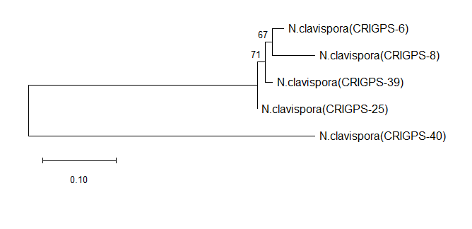
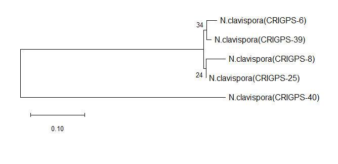

BIOINFORMATICS SEQUENCE & PHYLOGENETIC ANALYSIS

Overview

This project focuses on analyzing five DNA sequences from Neopestalotiopsis clavispora isolates. The goal is to compute basic sequence properties and evaluate their evolutionary relationships using phylogenetic methods.

DNA Sequence Analysis

The script sequence_stats.py computes:

Sequence length

GC content (%)

Total number of sequences

Input file: sequences.fasta
Output file: sequence_stats.csv

Phylogenetic Analysis

Five isolates (Neopestalotiopsis clavispora: CRIGPS-6, CRIGPS-8, CRIGPS-25, CRIGPS-39, CRIGPS-40) were analyzed using:

Maximum Likelihood (ML)

Neighbor-Joining (NJ)

1000 bootstrap replications

Software: MEGA 12

## Phylogenetic Trees

**Maximum Likelihood Tree**

**Neighbor-Joining Tree**

Results

All isolates clustered within the N. clavispora species lineage.

CRIGPS-6 and CRIGPS-8 consistently formed a close cluster.

CRIGPS-39 is strongly associated with the above cluster in both analyses.

CRIGPS-25 remains within the lineage but shows slight topological variation.

CRIGPS-40 shows the greatest divergence based on branch length.

Both phylogenetic methods support that these isolates are Neopestalotiopsis clavispora with minor genetic differences among them.
